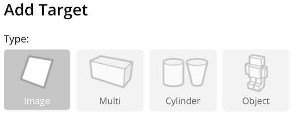

# Unidade 3

Local para postar a atividade da unidade 3.  

## Planetas do Sistema Solar em RA

Pode usar o [tcc_EvandroMatheusSchmitz](#tcc_evandromatheusschmitz) como base.

- ter os mesmo planetas  
- ter marcador de "informação"  
- ter marcador de "dissecção"  
- ter proporção entre os planetas (sim/não)  

Usar o Vuforia para registrar os marcadores, mas somente do tipo "target image"
  <http://developer.vuforia.com>  

  

### tcc_EvandroMatheusSchmitz

[tcc_EvandroMatheusSchmitz](./tcc_EvandroMatheusSchmitz/)  

<https://github.com/gcgfurb/tcc_EvandroMatheusSchmitz>  
Unity: 2017.1.1f1  